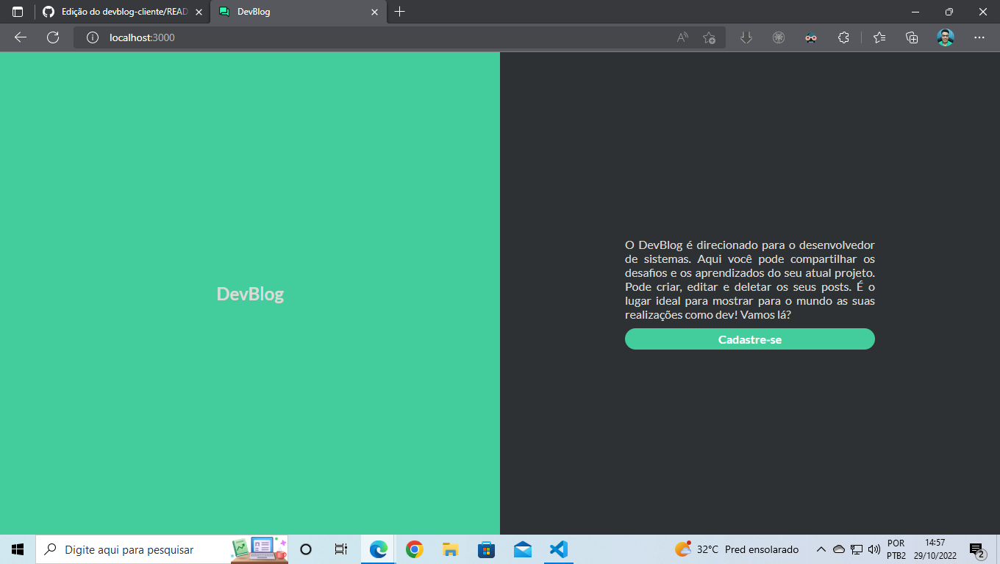

# DevBlog

# O DevBlog foi criado pensando no desenvolvedor de sistemas. Aqui você pode compartilhar os desafios e os aprendizados do seu atual projeto. Pode criar, editar e deletar os seus posts. É o lugar ideal para mostrar para o mundo as suas realizações como desenvolvedor.

# Link do reposiório do Back-End: https://github.com/danieljosias/devblog-server 

# Tecnologias utilizadas no Front-End: React, TypeScript, Styled Components, Axios, Yup, React Toastify, React Modal, React icons.

# As tecnologias utilizadas no Back-End: Node, Express, Postgres, TypeORM, TypeScript.

# Imagens do blog
 

